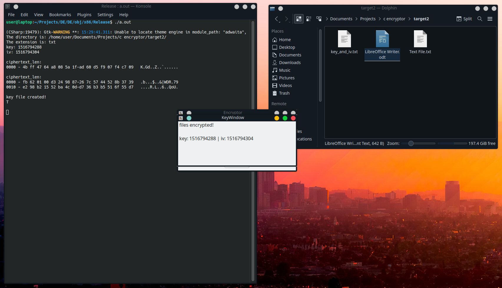

# Super Simple Mono Encryption Application

The encryptor application is a [Mono](https://github.com/mono/mono) .NET runtime application that encrypts all file of a specified extension in a directory, and gives the user the randomized key and iv for them to decrypt it later.

compiling requires the -fpermissive tag:

```
g++ main.cpp -fpermissive -lcrypto `pkg-config --cflags --libs mono-2`
```

DE.exe could be mkbundled with the output, but I did not do that here. See [Release](/Release) for the final release and [/Debug](/DE/obj/x86/Debug/) for the embedding mono.

The embedded runtime output binary and DE.exe are not cross compatable, so to run the application you must run the gcc output

```
./a.out
```


To encrypt the directory you simply input the path to the directory, and then specify the extension of file you would like to encrypt.



# Embedding Mono

The encrypting code for this application is done in C, whereas the actual embedding of the mono runtime and passing of methods is done in Cpp. I eventually figured out how to get cpp working after going through a few [Mono issues](https://github.com/mono/mono/issues), which was a huge help and there community is really helpful!

See [Embedding Mono](https://www.mono-project.com/docs/advanced/embedding/) for a quick startup into embedding the runtime in C, however for some reason it doesnt mention that you must include the mono-config in your embedded runtime... the more you know!

```
#include <mono/metadata/mono-config.h>
```

# MonoDevelop

A very good option for compiling and maintaining c# .NET applications, [MonoDevelop](https://www.monodevelop.com) is a great alternative for linux users who want an application window gui. It's not without it's problems though, as it's github was archived in 2020, and I did have an issue with designing other windows that weren't the MainWindow in the project. That is the only problem I've found, however, and it is quite easy to open the project in vscode and fix the parts that are messed up compared to building the whole project from scratch lol.